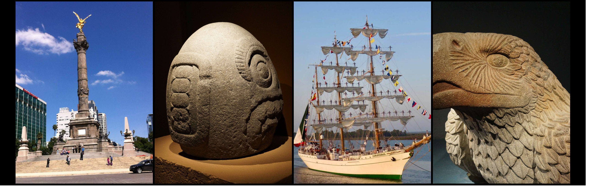
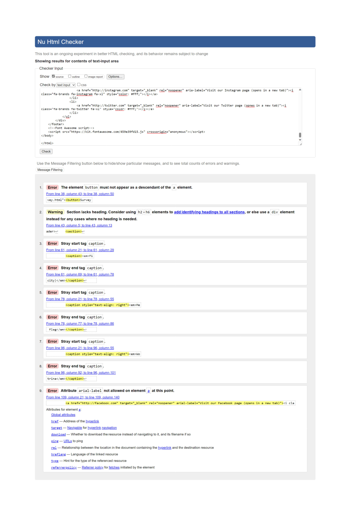
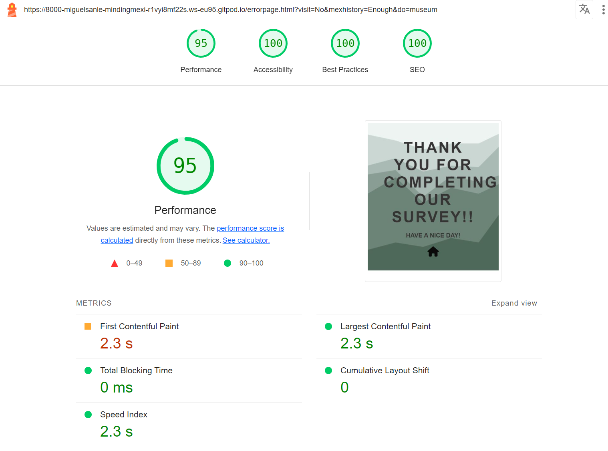

# MINDING MEXICO

This website is made for people who love Mexico and for all the people who wants to know more about it's amazing culture, history and hidden places.

Visit the deployed website [here](https://miguelsanleon.github.io/Minding-Mexico/)

## Mockup

## Table of contents

1. [User Experience (UX)](#user-experience-ux)
    * [Project Goals](#project-goals)
    * [Color Scheme](#color-scheme)
    * [Typography](#typography)
    * [Users stories](#users-stories)
 2. [Features](#features)
    * [General](#general)
    * [Landing page](#landing-page)
    * [Recipe page](#recipe-page)
    * [Survey page](#survey-page)
    * [Error Page](#error-page)
3. [Technologies Used](#technologies-used)
    * [Languages Used](#languages-used)
    * [Frameworks, Libraries and Programs Used](#frameworks-libraries-and-programs-used)
4. [Testing](#testing)
    * [Code Validation](#code-validation)
    * [Accessibility](#accessibility)
    * [Tools Testing](#tools-testing)
    * [Testing stories](#testing-stories)
    * [Manual Testing](#manual-testing)
    * [Unfixed bugs](#unfixed-bugs)
5. [Finished Product](#finished-product)
6. [Deployment](#deployment)
    * [GitHub-deploy](#github-deploy)
7. [Credits](#credits)
    * [Content](#content)
    * [Media](#media)
    * [Code](#code)
8. [Acknowledgements](#acknowledgements)

## User experience

### Project Goals

* The website should display the colors of the Mexican flag and maintein a clean and clear style.

* It should offer information about Mexican history, culture and tradition that reflects the beauty of Mexico.

* It should include a typical recipe for popular Mexican food that is easy to make in any corner of the world.

* It should include a survey that encourages the user to learn more about Mexico and venture to visit it.
### Color Reference

| Color             | Hex                                                                |
| ----------------- | ------------------------------------------------------------------ |
| Example Color |  #54595f |
| Example Color |  #006847|
| Example Color |  #fff |
| Example Color |  #ce1126 |
| Example Color |  #689F9B |

* The colors chosen for the website are the 3 colors of the flag, green, white and red. Two more shades of green have been used, one lighter and the other with some darker contrast for letters and fills.
### Typography

For typography, Merryweather and Roboto fonts were used. Merryweather was chosen for the headers and the body of the page was made with Roboto.
### Users stories

As a user:
* I would like to receive correct and truthful information about Mexico.
* I would like to see nice pictures related to mexican history.
* I would like to see nice pictures related to mexican culture.
* I would like to have a good mexican recipe to enjoy mexican food.
* I would like to have some interaction with in the website.

[back to top](#minding-mexico)

## Features

### General

* Responsive design for all device sizes.

* Respect the color scheme and display the information in a clear, concise and 
understandable way for the user.

* **Header** 

    - The header contains the web logo, a simple desing with the name of the website.
    - The navigation bar has the green colour of the mexican flag, with links in white, that turns
     black when hover, to enhance user experience.
    - All pages has same navigation bar, except error page. The navbar has links to all pages and
     also to the 3 columns in the main page.

* **Footer**

    - The footer is the same red color as the mexican flag and contains 3 links for the most
     popular social networks, facebook, instagram and twitter, which open in a new window.

### Landing page

* The landing page consists of 4 sections:

    - A main image that in turn contains 4 beautiful photos of Mexico: the angel of 
          independence in Mexico City, a pre-Hispanic egg-shaped sculpture with the face
          of an Aztec god carved on it, the flagship of the Mexican navy, the Cuauhtemoc and
          finally the eagle head carved in stone from the pre-Hispanic era.

    

    - Mexico from the heart, with a brief introduction to mexico and a brief history of the
        construction of the fine arts palace in mexico city. you can also enjoy an image of the
        fine arts palace.

    

     - The mexican flag and shield, with the history of the Mexican shield and a description
        of the Mexican flag. At the bottom you can admire the mexican flag. 

    

      - Mexican culture, where the festival of the day of the dead in Mexico is described, its 
        customs and its origins.You can also enjoy a mexican woman dressed up as a Catrina.

      

### Recipe page

- The recipe page contains the recipe for guacamole dip, and is made up of 3 sections
      arranged in columns with an image at the bottom:

    - The first column, Guacalome recipe, contains a description of the dish, the history
          behind it and the most popular uses for guacamole.

    

    - The second column, Ingredients, contains the ingredients for the recipe.

    

    - The third column, contains the instruction or method to create this delicuous dip.

    

### Survey page

- The survey page only has 3 questions with 3 options each, and a submit button that send you to the error page.

### Error page

- The error page is a simple desing with a thanks message and a button to return to landing page.

[back to top](#minding-mexico)

## Technologies Used

### Languages Used

* [HTML5](https://en.wikipedia.org/wiki/HTML5)
* [CSS3](https://en.wikipedia.org/wiki/CSS)

### Frameworks, Libraries and Programs Used

* [Google Fonts](https://fonts.google.com/)
    - Google Fonts was used to import the fonts Roboto and Merryweather into the style.css file.

* [Font Awesome](https://fontawesome.com/)
     - Font Awesome was used throughout all pages to add icons in order to create a better visual experience for UX purposes.

* [TinyPNG](https://tinypng.com/)
    - TinyPNG was used to reduce the file size of the images for the website.

* [IloveIMG](https://www.iloveimg.com/es)
    - IloveIMG was used to resize the images in order to drastically reduce the image weight.

* [GitPod](https://gitpod.io/)
     - GitPod was used for writing code, committing, and then pushing to GitHub.

* [GitHub](https://github.com/)
     - GitHub was used to store the project after pushing.

* [Am I Responsive?](http://ami.responsivedesign.is/#)
    - Am I Responsive was used to generate mockup imagery to be used in this readme.md

* [Haikei](https://app.haikei.app/)
    - Haikei was used to produce the background image for the error page.

* [Pexels](https://www.pexels.com/es-es/)
    - Pexels was used to find some of the images shown on the landing page and recipe page.

* [Chrome DevTools](https://developer.chrome.com/docs/devtools/)
    - Chrome DevTools was used during development process for code review and to test responsiveness.

* [W3C Markup Validator](https://validator.w3.org/)
    - W3C Markup Validator was used to validate the HTML code.

* [W3C CSS Validator](https://jigsaw.w3.org/css-validator/)
    - W3C CSS Validator was used to validate the CSS code.

[Back to top ](#minding-mexico)

## Testing

### Code Validation

* Buttons not allowed inside anchors in html, solved removing the button tags.
* Lack of heading in sections, solved removing section and replacing them with divs
* Caption tag not allowed, solved changing caption for p elements.
* Typing error in aria-label, typo fixed.

* All problems sorted.

* No errors or warnings to show.

* No errors or warnings to show.

* No errors or warnings to show.

* No errors Found.

### Accesibility

* Lighthouse Devtool from Google Chrome used for testing.
* Lighthouse testing:

 + Landing page:
    - Desktop version:

        

    - Mobile version:

        

+ Recipe page:
    - Desktop version:
        
        
    
    - Mobile version:
        
        

+ Survey page:
    - Desktop version:

        

    - Mobile version:

        

+ Error page:
    - Desktop version:

        

    - Mobile version:

        

### Tools testing
    
* [Chrome DevTools](https://developer.chrome.com/docs/devtools/)

    - Chrome DevTools was used to explore and modify HTML and CSS during development.
* Responsiveness
    
    - [Am I Responsive?](http://ami.responsivedesign.is/#) was used to check the website responsiveness on different screen size.

### Testing stories

* I would like to receive correct and truthful information about Mexico.

    - The web page includes interesting and proven information about Mexico.

* I would like to see nice pictures related to mexican history.

    - The websites has some pictures showing pre-hispanic sculptures, momuments and buildings.

* I would like to see nice pictures related to mexican culture.

    - The website has pictures of pre-hispanic culture and also a picture of a traditional festivity.

* I would like to have a good mexican recipe to enjoy mexican food.

    - The website displays the guacamole recipe with all the ingredients and method.

* I would like to have some interaction with in the website.

    - The website has a survey that everyone can fill out.

### Manual testing

* Common element testing

    - All Pages
        
        - **Header**

            - Clicking on the main logo will bring the user back to the landing page.

        - **Navigation Bar**

            - Hovering on the different navigation bar's links will trigger hover effect, highlighting the link for the user.

            - Clicking on the navigation bar's links will bring the user to the specified page.
        
        - **Footer**
        
            - Clicking on the social media links will open the specific website on a new tab.
    
    - Landing page:

        - This page only has interactions in the Header, navigation bar and footer that has been tested already.
    
    - Recipe page:

        - This page only has interactions in the Header, navigation bar and footer that has been tested already.
    
    - Survey page:

        - Clicking on the radio elements all of them works properly and leaving one or more empty will display a message "select one option" when submiting.

        - Hovering over submit button triggers hover effect and bring the user to error page.
    
    - Error page:

        - Fliping home icon works properly and will bring the user to home page when clicking.
    
### Unfixed bugs

* No unfixed bugs remaining in the website.

[Back to top ](#minding-mexico)

## Finished product

Page | Desktop version | Mobile version
--- | --- | ---
landing page |  | 
Recipe page |  | 
Survey page |  | 
Error page |  | 

[Back to top ](#minding-mexico)

## Deployment

### GitHub-deploy

* This are the steps I followed to deploy my project from its GitHub repository:

1. Open [GitHub Repository](https://github.com/) login and find the project repository.
2. At the top of the repository on the right corner click on settings button.
3. Go to Pages section inside settings.
4. Go to Branch tag and find a dropdown menu where you can choose between none or main.
5. Select main, after a short waiting GitHub will generate your website link.

[Back to top ](#minding-mexico)

## Credits

### Content

* All content was originally created and written by Miguel Angel Sanchez Leon, the developer.

### Media

* Main image and it's 4 pictures (angel.jpg arteaztecahuevo.jpg ateaztecapajaro.jpg cuautemoc.jpg) were taken personally by the developer in his visits to Mexico city and the Jurney of Cuauhtemoc ship to Huelva, his hometown.

* Fine arts palace in Mexico (palacioba.jpg) is an original photo taken by the developer

* The mexican flag (flag-42281_1280.png) was taken from [wikimedia commons](https://commons.wikimedia.org/wiki/File:Flag_of_Mexico.png)

* The picture of the woman dressed up as Catrina was taken from [Pexels](https://www.pexels.com/es-es/foto/mujer-vestido-disfraz-corona-14205785/) by Aldair Nunez.

* The picture of guacamole bowl from guacamole recipe section was taken from [Pexels](https://www.pexels.com/photo/green-vegetable-on-black-ceramic-bowl-4411802/) by Isabella Mendez

* The Avocado picture from ingredients section was taken from [Pexels](https://www.pexels.com/tr-tr/fotograf/pazarda-taze-avokado-14840388/) by Engin AKiurt.

* The picture with the bowl and the ingredients as well from method section was taken from [Pexels](https://www.pexels.com/photo/close-up-of-guacamole-bowl-6400018/) by Alleksana.

### Code

* [W3Schools](https://www.w3schools.com/) were visited for better understanding of coding elements syntax.

[Back to top ](#minding-mexico)

## Acknowledgements

* Code Institute and slack community for all the support in this project
* My Beautiful wife that has been helping with all my dutties at home to give more time for the project.
* Marcel, my mentor for his kind help and his time.

[Back to top ](#minding-mexico)